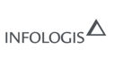
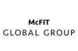
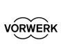

import Sections from "$components/Sections";
import Section from "$components/Section";
import Grid from "$components/Grid";
import KnockoutText from "$components/KnockoutText";

<Sections>
<Section video>

# avantgarde   freelance    collective.

</Section>
<Section>

<KnockoutText>petitcode ist ein kreatives kollektiv für digitale produkte. german translation still missing.</KnockoutText>

<Grid>

Sebastian Melz

Edgar Bongkishiy

Ottavio Braun

Samer Murad

Rodolfo Lopez

Mario Mielke

</Grid>

</Section>
<Section>

<KnockoutText>Our Clients</KnockoutText>

Our Clients are the life-source of our business and we strive to operate a highly effective and efficient organization, focused on meeting client objectives

<Grid>

</Grid>

</Section>
<Section>

<KnockoutText>Need more information?</KnockoutText>

[HERE]() you can download our bridge loan proposal.

## [hi@petitcode.de](mailto:hi@petitcode.de) [+49 (0) 30 640 803 38](tel:+493064080338)

</Section>
</Sections>
